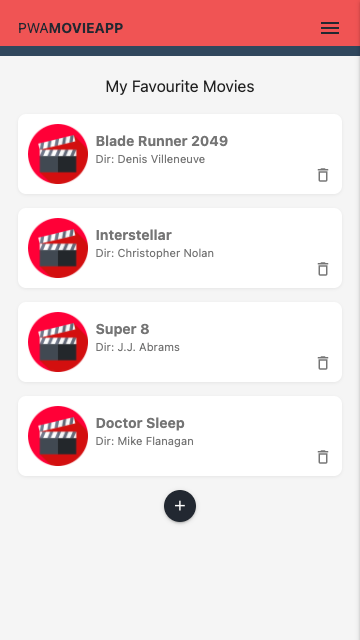

# pwa-app
A small exploratory app to build foundation knowledge in the Progressive Web Application (PWA) framework. 

## Influenced from
All details to this app was followed and guided by: 
https://github.com/iamshaunjp/pwa-tutorial
From the YouTube playlist:
https://www.youtube.com/playlist?list=PL4cUxeGkcC9gTxqJBcDmoi5Q2pzDusSL7

## Supported test cases
* Static Caching (Pre-cached content on initial Service Worker installation)
* Dynamic Caching (when the user fetches uncached content, it will be added to the cache for next fetch)
* Cache pages can work in offline mode
* Data is cached in IndexDb and also works in offline mode

## Tools I used:
* Materialize: https://materializecss.com/
* Andriod Studio: https://developer.android.com/studio
* Google's Firebase + Cloud Firestore: https://firebase.google.com/products/firestore
